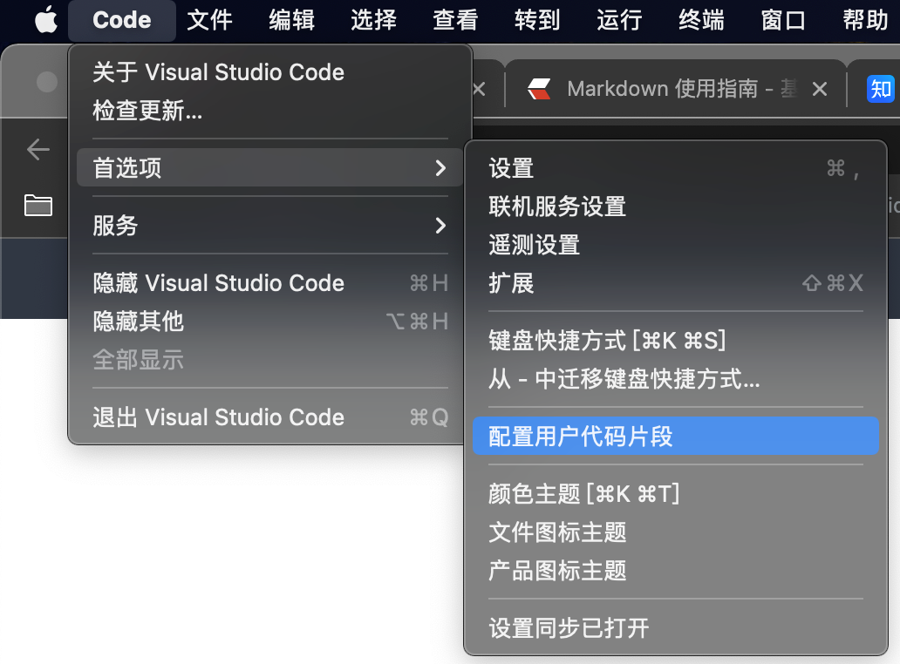

#### 插件

shell编程：ShellCheck
颜色主题：One Dark Pro，atom one dark
图标主题：Material Icon Theme
Office Viewer
Rainbow Brackets
markdown写作：Markdown All in One，paste image


Markdown All in One 快捷键
```
Key    Command
Ctrl + B    粗体
Ctrl + I    斜体
Alt + S    删除线
Ctrl + Shift + ]    标题(uplevel)
Ctrl + Shift + [    标题(downlevel)
Alt + C    Check/Uncheck task list item
切换数学环境 ctrl+m
格式化表格 alt+shift+f
格式化任务列表 alt+c
```

#### 配置文件
```json
{
    "workbench.startupEditor": "none",
    "workbench.editor.untitled.hint": "hidden",
    "workbench.iconTheme": "material-icon-theme",
    "workbench.colorTheme": "One Dark Pro",
    "security.workspace.trust.untrustedFiles": "open",
    "explorer.confirmDelete": false,
    "explorer.confirmDragAndDrop": false,
    "files.autoSave": "afterDelay",
    "vscode-office.openOutline": true,
    "editor.fontWeight": "normal",
    // 最后一行不会一直向上滚动
    "editor.scrollBeyondLastLine": false,
    // 字体
    "editor.fontFamily": "'DejaVu Sans Mono','Hack'",
    // 自动插入右括号和引号
    "editor.autoClosingBrackets": "always",
    "editor.autoClosingQuotes": "always",
    "vscode-md.options.lang": "zh_CN",
    "editor.renderWhitespace": "all",
    "markdown.extension.list.indentationSize": "inherit",
    "markdown.extension.orderedList.marker": "one",
    "markdown.extension.print.theme": "dark",
    // 取消光标在单词附近的高亮
    "editor.occurrencesHighlight": false,
    "markdown.preview.breaks": true,
    "editor.fontLigatures": false,
    "[markdown]": {
        "editor.unicodeHighlight.ambiguousCharacters": false,
        "editor.unicodeHighlight.invisibleCharacters": false,
        "editor.wordWrap": "on",
        // 代码提示
        "editor.quickSuggestions": {
          "comments": "on",
          "strings": "on",
          "other": "on"
        }
      },
      "pasteImage.path": "${currentFileDir}/image",
      "markdown.extension.toc.levels": "1..4"
}
```

#### 自定义代码片段



选择应用的文件类型


$1 为光标初始位置，按tab后跳到 $2 的位置，以此类推

